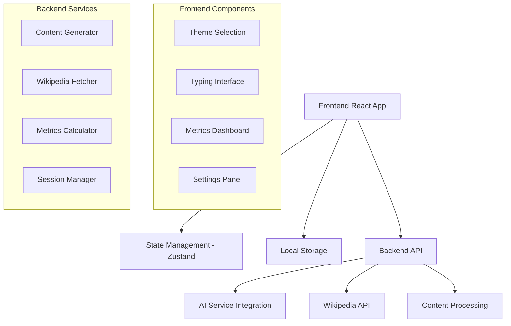

# Design Document

## Overview

O Typing Study App será uma aplicação web moderna construída com React/TypeScript no frontend e Node.js no backend. A arquitetura seguirá padrões de Single Page Application (SPA) com estado gerenciado centralmente, integração com APIs de IA (OpenAI/Gemini), e persistência local para métricas de usuário.

## Architecture

### High-Level Architecture



### Technology Stack

**Frontend:**
- React 18 com TypeScript
- Zustand para gerenciamento de estado
- Tailwind CSS para estilização
- Chart.js para gráficos de progresso
- React Query para cache de dados

**Backend:**
- Node.js com Express
- TypeScript
- Axios para chamadas HTTP
- Rate limiting para APIs externas

**Integrações:**
- OpenAI API ou Google Gemini para geração de conteúdo
- Wikipedia API para busca de artigos
- Local Storage para persistência de dados do usuário

## Components and Interfaces

### Frontend Components

#### 1. ThemeSelector Component
```typescript
interface ThemeSelector {
  selectedTheme: string;
  customTheme: string;
  onThemeSelect: (theme: string) => void;
  onCustomThemeSubmit: (theme: string) => void;
  recentThemes: string[];
}
```

#### 2. TypingInterface Component
```typescript
interface TypingInterface {
  content: string;
  currentPosition: number;
  userInput: string;
  isActive: boolean;
  onInputChange: (input: string) => void;
  onSessionStart: () => void;
  onSessionEnd: () => void;
  highlightErrors: boolean;
}
```

#### 3. MetricsDashboard Component
```typescript
interface MetricsDashboard {
  currentWPM: number;
  averageWPM: number;
  accuracy: number;
  errorCount: number;
  sessionTime: number;
  historicalData: TypingSession[];
  showGraphs: boolean;
}
```

#### 4. KeyboardLayoutSelector Component
```typescript
interface KeyboardLayoutSelector {
  availableLayouts: KeyboardLayout[];
  selectedLayout: string;
  onLayoutChange: (layout: string) => void;
  previewMode: boolean;
}
```

### Backend Interfaces

#### 1. Content Service
```typescript
interface ContentService {
  generateContent(theme: string, length: number): Promise<GeneratedContent>;
  fetchWikipediaContent(theme: string): Promise<WikipediaContent>;
  combineContent(aiContent: string, wikiContent: string): Promise<string>;
}

interface GeneratedContent {
  text: string;
  source: 'ai';
  wordCount: number;
  difficulty: 'easy' | 'medium' | 'hard';
}
```

#### 2. Metrics Service
```typescript
interface MetricsCalculator {
  calculateWPM(charactersTyped: number, timeElapsed: number): number;
  calculateAccuracy(correctChars: number, totalChars: number): number;
  identifyErrorPatterns(errors: TypingError[]): ErrorPattern[];
  updateSessionMetrics(session: TypingSession): void;
}

interface TypingSession {
  id: string;
  theme: string;
  startTime: Date;
  endTime: Date;
  wpm: number;
  accuracy: number;
  errors: TypingError[];
  content: string;
}
```

## Data Models

### Core Data Models

#### 1. User Session
```typescript
interface UserSession {
  sessionId: string;
  userId?: string; // Optional for guest users
  theme: string;
  keyboardLayout: string;
  startTime: Date;
  endTime?: Date;
  isActive: boolean;
  content: string;
  userProgress: {
    currentPosition: number;
    typedText: string;
    errors: TypingError[];
  };
  metrics: SessionMetrics;
}
```

#### 2. Typing Metrics
```typescript
interface SessionMetrics {
  wpm: number;
  averageWPM: number;
  accuracy: number;
  totalCharacters: number;
  correctCharacters: number;
  errorCount: number;
  timeElapsed: number; // in seconds
  keystrokesPerMinute: number;
}
```

#### 3. Error Tracking
```typescript
interface TypingError {
  position: number;
  expectedChar: string;
  typedChar: string;
  timestamp: Date;
  corrected: boolean;
}

interface ErrorPattern {
  errorType: 'substitution' | 'omission' | 'insertion';
  frequency: number;
  commonMistakes: { expected: string; typed: string; count: number }[];
}
```

#### 4. Content Structure
```typescript
interface StudyContent {
  id: string;
  theme: string;
  text: string;
  source: 'ai' | 'wikipedia' | 'combined';
  difficulty: number;
  wordCount: number;
  estimatedTime: number; // in minutes
  createdAt: Date;
  metadata: {
    aiModel?: string;
    wikipediaArticle?: string;
    language: string;
  };
}
```

## Error Handling

### Frontend Error Handling

1. **Content Loading Errors**
   - Fallback para conteúdo pré-definido se IA/Wikipedia falharem
   - Loading states com skeleton screens
   - Retry mechanisms com backoff exponencial

2. **Typing Session Errors**
   - Auto-save de progresso a cada 30 segundos
   - Recovery de sessões interrompidas
   - Validação de input em tempo real

3. **Network Errors**
   - Offline mode com conteúdo cached
   - Queue de métricas para sincronização posterior
   - Graceful degradation de funcionalidades

### Backend Error Handling

1. **API Integration Errors**
   - Rate limiting com retry após cooldown
   - Fallback entre diferentes provedores de IA
   - Circuit breaker pattern para APIs externas

2. **Content Processing Errors**
   - Validação de conteúdo gerado (comprimento, idioma, adequação)
   - Sanitização de texto da Wikipedia
   - Backup content para temas populares

## Testing Strategy

### Unit Testing
- Componentes React com React Testing Library
- Funções de cálculo de métricas
- Utilitários de processamento de texto
- Validadores de input

### Integration Testing
- Fluxo completo de sessão de digitação
- Integração com APIs externas (mocked)
- Persistência de dados local
- Sincronização de estado

### End-to-End Testing
- Jornada completa do usuário
- Diferentes layouts de teclado
- Cenários de erro e recovery
- Performance em diferentes dispositivos

### Performance Testing
- Tempo de resposta da geração de conteúdo
- Responsividade da interface durante digitação
- Uso de memória com sessões longas
- Carregamento inicial da aplicação

## Security Considerations

1. **API Security**
   - Rate limiting por IP/usuário
   - Validação de input para prevenir injection
   - Sanitização de conteúdo gerado

2. **Data Privacy**
   - Dados armazenados localmente por padrão
   - Opção de modo anônimo
   - Não persistência de conteúdo sensível

3. **Content Safety**
   - Filtros para conteúdo inapropriado
   - Validação de temas inseridos pelo usuário
   - Moderação de conteúdo gerado pela IA